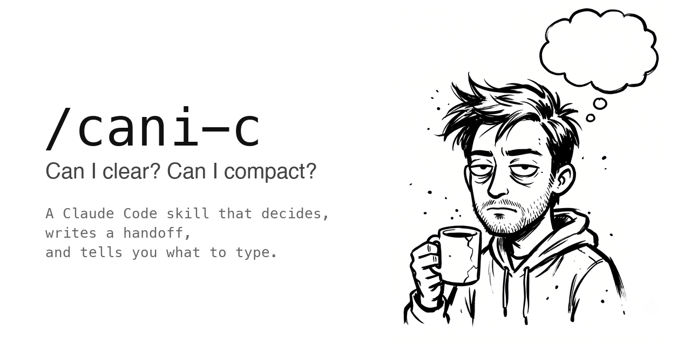

<p align="center"></p>

# cani-c

[English](README.md) · [한국어](README.ko.md)

> **"Can I clear? Can I compact?"** — 이 질문에 대신 답하고, 인수인계 문서(handoff)를 쓰고, 칠 명령까지 알려주는 [Claude Code](https://claude.ai/code) 스킬.

[](LICENSE)
[](https://code.claude.com/docs/en/skills)

## 문제

세션이 길어지면 컨텍스트 창이 가득 찬다. `/compact`나 `/clear`를 치려다가, 그 전에 매번 이런 걸 먼저 친다:

- "지금 compact 해도 돼?"
- "clear 해도 될까?"
- "다음 세션에서 이어갈 수 있게 전부 정리해줘"

세션마다, 같은 프롬프트를. 게다가 `/compact`는 손실 압축이라 뭐가 빠졌는지 알 수 없다.

## cani-c가 하는 일

```
/cani-c
```

1. **판정한다.** 먼저 지금 해도 되는 시점인지 본다. 서브에이전트가 아직 돌고 있거나, rebase가 중간이거나, 다음 단계가 수정 한 번이면 `not yet`이라고 하고 이유와 먼저 끝낼 일을 알려준다. 해도 되면 남은 작업이 지금 컨텍스트의 세부 내용에 얼마나 기대는지 보고 compact와 clear 중 하나를 고른다.
2. **정리할 것을 짚는다.** handoff만으로 해결 안 되는 것들: 커밋 안 된 변경, 아직 떠 있는 dev 서버, 영구 메모리로 남길 교훈.
3. **handoff를 쓴다.** 목표, 확정된 결정, 완료한 것, 순서대로 남은 일, 건드린 파일, 주의할 점을 Claude Code의 auto-memory(기본) 또는 리포 안 파일에 기록한다.
4. **칠 명령을 준다.** compact면 보존할 내용을 지정한 `/compact <focus>`, clear면 그냥 `/clear`.

다음 세션을 `continue from the cani-c handoff`로 열면 멈춘 곳에서 바로 이어간다. 그 작업이 끝나면:

```
/cani-c done
```

handoff를 지워서 오래된 컨텍스트가 계속 따라다니지 않게 한다.

## 예시

```
> /cani-c

compact recommended — 결제 리팩터링이 diff 중간이고, 다음 단계가 아직 컨텍스트에 있는 에러 로그를 필요로 함.
Before you run it:
- 커밋 안 된 파일 2개, 아직 커밋할 상태 아님 (test_refund.py 실패 중)
- 메모리에 저장함: 사용자는 retry 데코레이터를 원하지 않음
Handoff written: ~/.claude/projects/-Users-me-app/memory/cani-c-handoff.md
Next session: continue from the cani-c handoff

/compact preserve the unfinished items of the payments refactor, the decision to keep Stripe webhooks synchronous, and the paths of files being edited
```

이때 작성된 handoff:

```markdown
# cani-c handoff — app / payments refactor
written: 2026-09-18  session: 9f2c1b7e-4d3a-4e8b-a1c5-0b6d7e8f9a12  commit: a1b2c3d

## Goal
charge 생성을 PaymentService 하나 뒤로 옮겨서 재시도를 멱등하게 만든다.

## Fixed decisions (do not re-litigate)
- Webhook은 동기 유지. 큐 방식은 순서 버그로 시도 후 기각.

## Done
- 멱등 키가 있는 PaymentService.charge()
- 정상 경로 테스트

## Not done / next steps (in order)
1. test_refund.py의 실패 테스트 수정 (`charge_id` KeyError)
2. 새 서비스를 checkout_view.py에 연결
3. 레거시 charge_helpers.py 삭제

## Files touched
- src/payments/service.py — PaymentService 신규
- tests/test_refund.py — 실패 중, 1번 참고

## Watch out
- retry 데코레이터 추가 금지. 사용자가 두 번 거절함.
```

지금 하면 안 될 때:

```
> /cani-c

not yet — 테스트가 아직 돌고 있고, 이름 변경이 절반만 적용됨.
- 통합 테스트 서브에이전트가 아직 결과를 안 줬다. 지금 정리하면 왜 돌렸는지 모르는 세션에 결과가 떨어진다. 끝날 때까지 기다릴 것.
- users.email 이름이 마이그레이션에서만 바뀌고 models.py에는 그대로다. 먼저 마저 바꿀 것.

테스트 결과가 오고 이름 변경이 끝나면 /cani-c를 다시 실행.
```

## 인자

| 명령 | 동작 |
|---|---|
| `/cani-c` | 판정하고, handoff 쓰고, 칠 명령 알려줌 |
| `/cani-c clear` / `/cani-c compact` | compact/clear 선택 생략 (막는 요소는 경고로) |
| `/cani-c memory` / `/cani-c file` | handoff 저장 위치 (한 번만 묻고 기억함) |
| `/cani-c done` | handoff대로 작업을 마친 뒤 정리 |

한국어와 영어 모두 된다. 슬래시 없이 자연어로도 실행된다: "compact 해도 돼?", "컨텍스트 정리해줘", "can I compact?", "wrap up this session", "make it resumable".

## 설치

Claude Code 안에서 플러그인으로:

```
/plugin marketplace add Yang-woo/cani-c
/plugin install cani-c@cani-c
```

또는 스킬을 직접 복사하고 Claude Code를 재시작:

```bash
git clone https://github.com/Yang-woo/cani-c.git
cp -r cani-c/skills/cani-c ~/.claude/skills/cani-c
```

어느 쪽이든 모든 프로젝트에서 `/cani-c`를 쓸 수 있다.

auto memory(`~/.claude/projects/<project>/memory/`)는 Claude Code에서 기본으로 켜져 있다. `/memory`나 `autoMemoryEnabled: false`로 껐다면 file 모드로 폴백하고 그렇게 알려준다.

## memory vs file

**memory** (기본)는 `~/.claude/projects/<project>/memory/`에 쓴다. Claude Code가 세션 시작마다 인덱스를 자동으로 읽는 곳이다. 인덱스 한 줄만 올라오므로, 다음 세션을 열 때 칠 한 줄 프롬프트를 스킬이 알려준다. 리포에는 아무것도 남지 않는다. 프로젝트 폴더 단위로 분리된다.

**file**은 리포 안 `.claude/cani-c.md`에 쓴다. 팀원이나 다른 기기에서 이어받을 수 있다. 자동 로드하려면 `SessionStart` 훅이 필요한데, 스킬이 스니펫을 보여준다.

## 그냥 /compact 하면 안 되나?

`/compact`는 토큰 압박 속에서 모델이 쓴 요약만 남긴다. 뭘 잘라냈는지 볼 수 없다. cani-c는 compact나 clear *전에* 구조화된 handoff를 쓰고, 세션 ID를 기록해 둔다. 빠진 게 있으면 `/resume <id>`하거나 원본 transcript를 grep하면 된다.

handoff의 제목은 영어로 고정이고, 본문은 작업하던 언어로 쓰인다.

## 설계 원칙

- **스킬 하나, 파생 명령 없음.** 모든 변형은 인자다.
- **transcript 파서 없음.** 전체 jsonl은 이미 디스크에 있다. handoff에는 이어가는 데 필요한 것만 담는다.
- **설정 파일을 건드리지 않는다.** file 모드는 훅 스니펫을 보여주고 사용자가 직접 넣게 한다.

## 기여

PR 환영. 아이디어:

- auto-compact가 뜨기 전에 handoff를 자동으로 쓰는 `PreCompact` 훅
- 더 많은 언어의 트리거 문구
- 실제로 뭔가 빠졌던 handoff — 뭐가 빠졌는지 이슈로 올려주세요

## 라이선스

MIT
