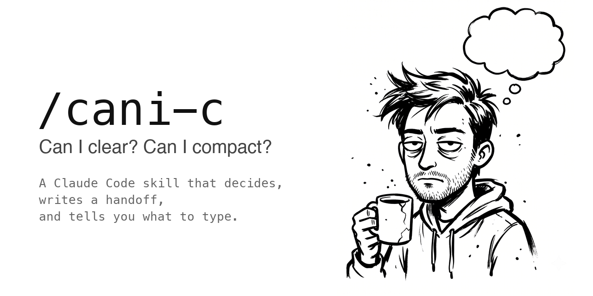

<p align="center"></p>

# cani-c

[English](README.md) · [한국어](README.ko.md)

> **"Can I clear? Can I compact?"** — A [Claude Code](https://claude.ai/code) skill that answers that question for you, writes a handoff, and tells you what to type.

[](LICENSE)
[](https://code.claude.com/docs/en/skills)

## The problem

Long sessions fill the context window. You reach for `/compact` or `/clear`, but first you type some version of:

- "is it safe to compact now?"
- "can I clear this?"
- "summarize everything so I can continue in a new session"

Every session. Same prompt. And `/compact` is lossy, so you never know what it dropped.

## What cani-c does

```
/cani-c
```

1. **Decides** compact vs clear based on whether the remaining work depends on details currently in context.
2. **Writes a handoff** — goal, fixed decisions, done, next steps in order, files touched, things to watch out for — into Claude Code's auto-memory (default) or a file in your repo.
3. **Gives you the command.** For compact, a `/compact <focus>` that names what to preserve. For clear, just `/clear`.

Open the next session with `continue from the cani-c handoff` and it picks up where you left off. When that work is finished:

```
/cani-c done
```

removes the handoff so stale context stops following you around.

## Example

```
> /cani-c

compact recommended — the payments refactor is mid-diff and the next step needs the error log still in context.
Handoff written: ~/.claude/projects/-Users-me-app/memory/cani-c-handoff.md
Next session: continue from the cani-c handoff

/compact preserve the unfinished items of the payments refactor, the decision to keep Stripe webhooks synchronous, and the paths of files being edited
```

The handoff it wrote:

```markdown
# cani-c handoff — app / payments refactor
written: 2026-09-18  session: 9f2c1b7e-4d3a-4e8b-a1c5-0b6d7e8f9a12  commit: a1b2c3d

## Goal
Move charge creation behind a single PaymentService so retries are idempotent.

## Fixed decisions (do not re-litigate)
- Webhooks stay synchronous. Queue was tried and rejected for ordering bugs.

## Done
- PaymentService.charge() with idempotency key
- Tests for the happy path

## Not done / next steps (in order)
1. Fix the failing test in test_refund.py (KeyError on `charge_id`)
2. Wire the new service into checkout_view.py
3. Delete legacy charge_helpers.py

## Files touched
- src/payments/service.py — new PaymentService
- tests/test_refund.py — failing, see step 1

## Watch out
- Do not add a retry decorator; the user rejected it twice.
```

## Arguments

| Command | What it does |
|---|---|
| `/cani-c` | judge, write handoff, tell me what to type |
| `/cani-c clear` / `/cani-c compact` | skip the judgment |
| `/cani-c memory` / `/cani-c file` | where the handoff goes (asked once, then remembered) |
| `/cani-c done` | clean up after the handoff has been worked through |

Works in English and Korean. It also triggers on plain language, no slash needed: "can I compact?", "wrap up this session", "make it resumable", "compact 해도 돼?", "컨텍스트 정리해줘".

## Install

As a plugin, inside Claude Code:

```
/plugin marketplace add Yang-woo/cani-c
/plugin install cani-c@cani-c
```

Or copy the skill by hand and restart Claude Code:

```bash
git clone https://github.com/Yang-woo/cani-c.git
cp -r cani-c/skills/cani-c ~/.claude/skills/cani-c
```

Either way, `/cani-c` is now available in every project.

Auto memory (`~/.claude/projects/<project>/memory/`) is on by default in Claude Code. If you turned it off with `/memory` or `autoMemoryEnabled: false`, cani-c falls back to file mode and says so.

## Memory vs file

**memory** (default) writes to `~/.claude/projects/<project>/memory/`, whose index Claude Code loads at the start of every session. Only the index line is loaded, so the skill tells you the one-line prompt to open the next session with. Nothing lands in your repo. Scoped per project folder.

**file** writes `.claude/cani-c.md` in your repo so teammates and other machines can pick it up. Add a `SessionStart` hook to auto-load it; the skill shows you the snippet.

## Why not just /compact?

`/compact` keeps a summary the model wrote under token pressure. You cannot see what it cut. cani-c writes a structured handoff *before* you compact or clear, and records the session ID so you can `/resume <id>` or grep the original transcript if something is missing.

The handoff headings stay in English; the body is written in whatever language you were working in.

## Design choices

- **One skill, no sub-commands.** Every variant is an argument.
- **No transcript parser.** The full jsonl is already on disk; the handoff only holds what resuming needs.
- **Never edits your settings.** File mode shows you the hook snippet and lets you paste it.

## Contributing

PRs welcome. Ideas:

- A `PreCompact` hook that writes the handoff automatically before auto-compact fires
- Trigger phrases in more languages
- Real-world handoffs that lost something — open an issue with what was missing

## License

MIT
